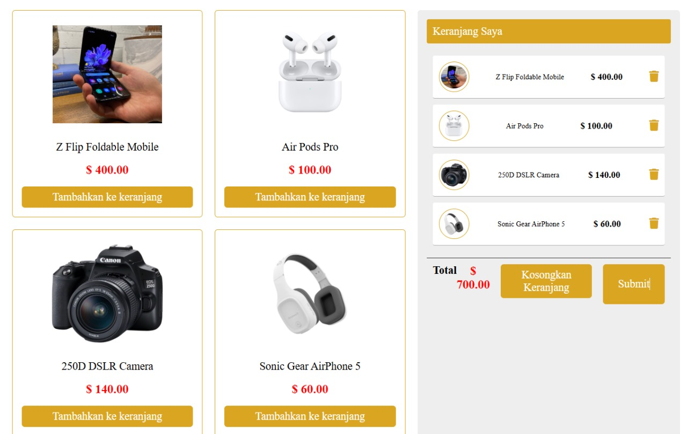

# 🛒 E-Commerce Checkout Simulation Website

Hello! 👋  
This repository contains a simple simulation of an e-commerce shopping experience — from browsing products to generating a unique transaction code via hashing! 🔐🧾

---

## 🧭 Features

This project was built to simulate the **core flow** of a basic e-commerce system. Here’s what’s included:

- 🛍️ **Product Showcase** – A clean and interactive product list.
- ➕ **Add to Cart** – Click and add products to your shopping cart.
- ✅ **Checkout Process** – Finalize the transaction with one click.
- 🔐 **Transaction Hashing** – After checkout, a unique hash code is automatically generated to represent the transaction.
- 🗃️ **Transaction Logging** – All completed checkouts are recorded for tracking purposes.

---

## 🧠 Why This Project?

I created this project to:

- Understand and simulate basic e-commerce logic 💡  
- Practice working with dynamic UI and state management 🧩  
- Explore simple **hashing techniques** for transaction verification 🔐  
- Prepare for more complex full-stack commerce platforms 💼

---

## 💻 Tech Stack

Built with:

- 🌐 HTML, CSS, JavaScript  
- 🧮 Hashing algorithm (e.g. SHA256) using JavaScript libraries or native functions  
- 💾 Local storage or in-memory array for data simulation  
- 🎨 Simple UI for an intuitive user experience

---

## 📸 Preview

Live version: [🔗 Demo Website](https://nadaqqn.github.io/Transaksi-produk-dengan-metode-blockchain/)

---

## 🛠 How It Works

1. Browse products displayed on the homepage.  
2. Click "Add to Cart" to select items.  
3. Go to the cart and hit **Checkout**.  
4. A unique transaction hash will be generated and stored.  
5. The transaction details are logged for reference.

---

## 🚀 Future Improvements

- 🧾 PDF receipt generation after checkout  
- 💳 Payment gateway simulation  
- 🔗 Backend integration for real-time transactions  
- 🧑‍💻 Admin dashboard for transaction management

---

## 🤝 Let's Collaborate!

Interested in improving or expanding this project? Feel free to fork, contribute, or get in touch!

- 💌 linktr.ee: https://linktr.ee/qonitaqq

---

> *“Innovation is the ability to see change as an opportunity – not a threat.”* – Steve Jobs 🔁

---

Thanks for checking it out! If you like this project, consider giving it a ⭐️ to support and revisit later.
